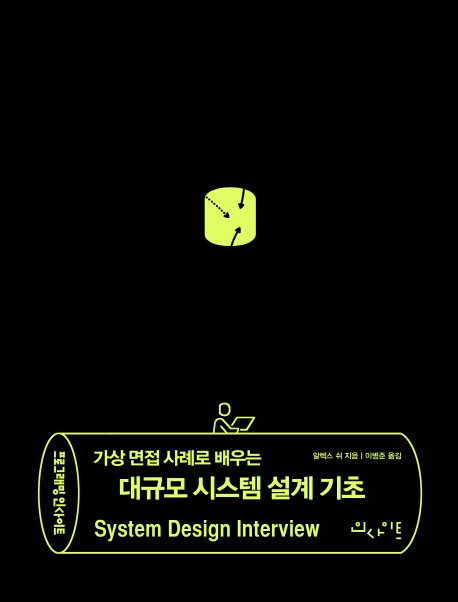
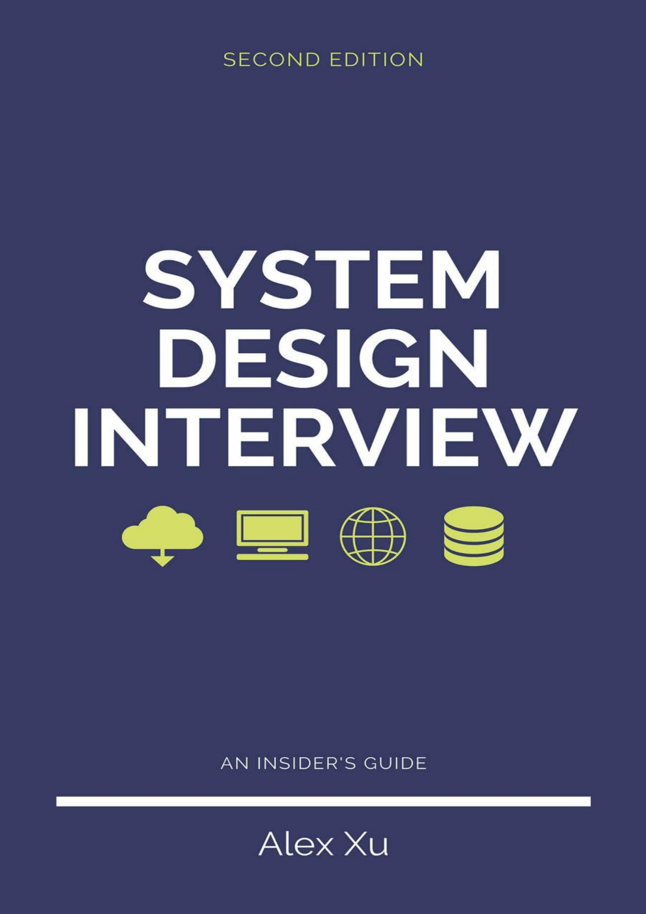

# 가상 면접 사례로 배우는 대규모 시스템 설계 기초

> 원제 : System Design Interview - An Insider's Guide, Second Edition

 

### 스터디원

- 권민준 ( @MinJunKweon )
- 양희찬 ( @log-info )
- 이도현 ( @2rohyun )
- 조민국 ( @minkukjo )

### 스터디 방식

- 매주 한 챕터씩 Issue를 생성해서 각자 중요한 내용을 정리해서 코멘트를 남깁니다.
  - 코멘트 내용은 중요한 부분을 정리한 것이나, 질문, 추가로 알면 좋은 내용들을 남깁니다.
- 매주 일요일 22시 정각마다 온라인으로 간단하게 미팅을 진행합니다.
  - 플랫폼 : Zoom
- 스터디원 순번을 정해서 라운드로빈으로 1개 챕터씩 오너십을 갖습니다.
  1. 도현
  2. 민국
  3. 민준
  4. 희찬
- 스터디한 것은 녹화해서 유튜브에 올리고 private 링크로 올립니다.

### Reference

- 도서정보 - [인사이트 출판사 도서정보 페이지](https://blog.insightbook.co.kr/2021/07/22/%e3%80%8a%ea%b0%80%ec%83%81-%eb%a9%b4%ec%a0%91-%ec%82%ac%eb%a1%80%eb%a1%9c-%eb%b0%b0%ec%9a%b0%eb%8a%94-%eb%8c%80%ea%b7%9c%eb%aa%a8-%ec%8b%9c%ec%8a%a4%ed%85%9c-%ec%84%a4%ea%b3%84-%ea%b8%b0%ec%b4%88/)